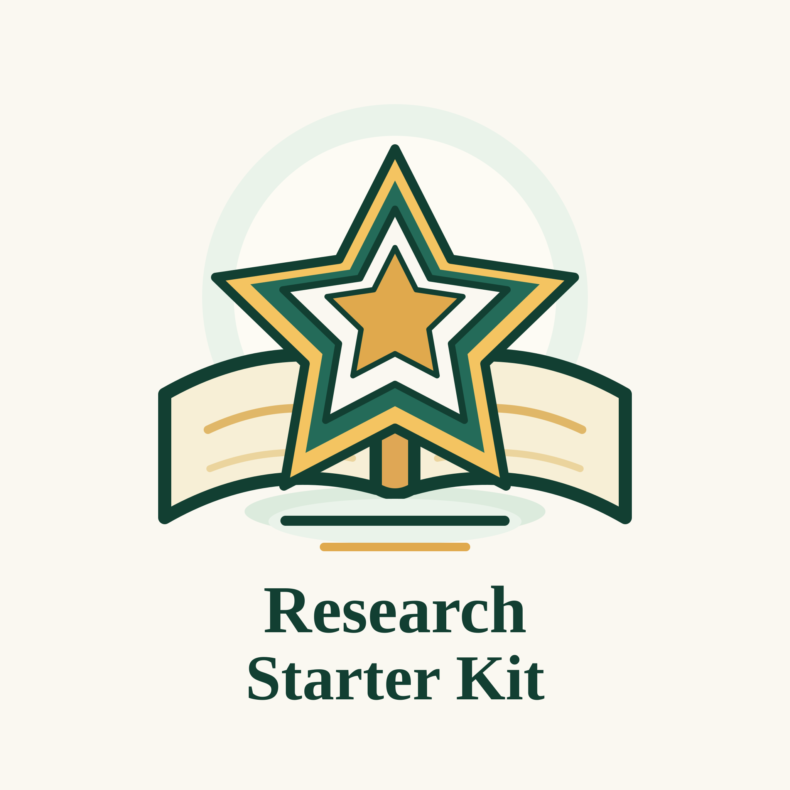

  

# 科研入门指南：从0开始，掌握做科研、写论文的基本流程

> 面向刚进入课题组参与科研工作的同学，帮助大家快速建立对科研的基本认识，了解如何做科研，如何写论文。

  <a href="https://lamda-nesy.github.io/Research-Starter-Kit/"><strong>网站</strong></a>
  ·
  <a href="#handbook"><strong>手册</strong></a>
  ·
  <a href="#致谢"><strong>致谢</strong></a>

  
  

## 为什么做这个项目

大家好，我是[郭兰哲](https://www.lamda.nju.edu.cn/guolz/)，南京大学智能科学与技术学院准聘助理教授，博士生导师，主要研究方向是：智能体（Agent）、世界模型（World Model）、神经符号学习（Neuro-Symbolic Learning）、表格数据大模型（Tabular Foundation Model）。

每年都会有新的研究生入学，也会有很多本科生想要提前进组参与科研工作，每个人刚进来的时候都要对他们讲一遍什么是科研，怎么样做科研，怎么样找论文、读论文，怎么判断论文的价值，怎么发现问题，怎么想Idea，到学生第一次投稿的时候，很多共性问题也要重复的讲。同时也有很多人可能处于被放养状态，没有相关的老师指导，因此决定把如何做科研的一些基本认识，整理成文档。

这个项目仍处在早期阶段，我们会持续的更新与完善，如果你觉得这个项目对你有帮助，请点亮右上角的⭐️Star⭐️！谢谢！

## 适合谁阅读

- 刚进入实验室或课题组的本科生、硕士生、博士生
- 第一次参与科研项目的同学
- 希望系统化梳理科研工具链与工作习惯的新成员
- 开始带新人做科研的导师、博士生

## 📖 手册：如何做科研与写论文

<strong>📚 <a href="https://dy8q0bnq8y.feishu.cn/wiki/LfR9woW57iWpQWkRKJhcoFF7ndb?from=from_copylink">如何做科研？</a></strong>

- ☁️ [如何找论文？](https://dy8q0bnq8y.feishu.cn/wiki/Co5awLsRiiuYAlkqHhCcwGBanub?from=from_copylink)
- 📄 [如何读论文？](https://dy8q0bnq8y.feishu.cn/wiki/Ow8fw2HtEiixDgkWlkbckdvHnef?from=from_copylink)
- 💡 [如何想 Idea？](https://dy8q0bnq8y.feishu.cn/wiki/MxYVwN0lEiv5HUkLEJccRJI3nTd?from=from_copylink)
- 🎙️ [如何进行学术汇报](https://dy8q0bnq8y.feishu.cn/wiki/Wr0lwNhUdiMpt1kK6UmcgnWEnJI?from=from_copylink)
- 🧭 [如何高效 Meeting](https://dy8q0bnq8y.feishu.cn/wiki/B8FBwaHe6ivi2skemtFc3lWbnmh?from=from_copylink)
- 📝 [一些好的习惯](https://dy8q0bnq8y.feishu.cn/wiki/Bp2AwrSnAiGaH2khJaqczVXznwc?from=from_copylink)

<strong>📄 <a href="https://dy8q0bnq8y.feishu.cn/wiki/NsK3wnWeiivKNukNJOqcd985nTY?from=from_copylink">如何写论文？</a></strong>

- 📝 [论文画图指南](https://dy8q0bnq8y.feishu.cn/wiki/OGpcw6zaRiQ6OwkNxfYcl7IKnBh?from=from_copylink)
- 📝 [如何写论文-Abstract](https://dy8q0bnq8y.feishu.cn/wiki/Tz2pwvxTyiBK0zkCVszcZmJ3nwd?from=from_copylink)
- 📝 [如何写论文-Introduction](https://dy8q0bnq8y.feishu.cn/wiki/ULATwBu2MiLqqRkXxV6c2S7AnPd?from=from_copylink)
- 📝 [如何写论文-Related Works](https://dy8q0bnq8y.feishu.cn/wiki/CLSAwWm6qifjwQkTd82czgMNnYf?from=from_copylink)
- 📝 [如何写论文-Methods](https://dy8q0bnq8y.feishu.cn/wiki/CtiAwh1eOiqOfCkPKVLc0WsxnZg?from=from_copylink)
- 📝 [如何写论文-Experiments](https://dy8q0bnq8y.feishu.cn/wiki/KHgSw2MkrikxlskGe5qclkdbn2c?from=from_copylink)
- 📝 [如何写论文-Reference](https://dy8q0bnq8y.feishu.cn/wiki/A4q2wSnmRi91rykHke1cQIhnnAh?from=from_copylink)
- 📝 [如何 Rebuttal](https://dy8q0bnq8y.feishu.cn/wiki/M9d1wv5Efi2aG4kH4IDc5zqVnQh?from=from_copylink)

<strong>杂项</strong>

- 🧳 [学术会议参会指南](https://dy8q0bnq8y.feishu.cn/wiki/HDYdwMgrki0C35kR147cquf2nph?from=from_copylink)
- 💰 [有哪些能申请的奖学金](https://dy8q0bnq8y.feishu.cn/wiki/SN0Dw5gvhidkMtkcmAYcXbUhnSh?from=from_copylink)

## 致谢

项目得到了陈煜旸、葛凌岳、张逸凯等同学的帮助，也借鉴了以下相关资料：

- [周志华老师：做研究与写论文](https://zhuanlan.zhihu.com/p/98747105)
- [凌晓峰/杨强《学术研究，你的成功之道](https://book.douban.com/subject/20284332/)
- [浙江大学彭思达老师：我的科研经验](https://github.com/pengsida/learning_research)
- [东南大学魏秀参老师：浅谈学术Rebuttal](https://zhuanlan.zhihu.com/p/104298923)
- [Paper Rebuttal Tips](https://github.com/MLNLP-World/Paper-Rebuttal-Tips)
- [Science Research Writing: For Non-Native Speakers of English](https://book.douban.com/subject/4473481/)
